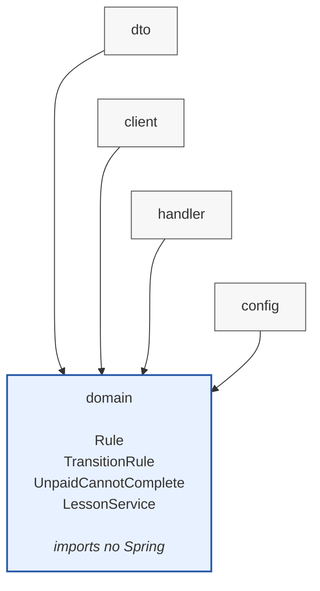

## Product

We build a tutoring marketplace. Students and tutors track lessons.

A student finds a tutor, books a time slot and pays through the platform. The platform
holds the payment until the lesson has taken place, then pays the tutor and keeps a
commission on every lesson. Money moves each time a lesson changes status, so the order
of those changes is enforced in code rather than left to whoever edits the record.

Run the tests with `mvn -q test` (Java 21).

## Core item

The core item is a **lesson**: one student, one tutor, one time slot.

It is identified by `LessonId` (for example `LES-2026-0042`), which rejects a null or
blank value. A lesson has exactly one `LessonStatus` at a time. `LessonStatus` is a
sealed interface with four variants:

- `Requested` — the student asked the tutor for a slot; no money has moved
- `Confirmed` — the tutor accepted; the platform holds the student's payment
- `Completed` — the lesson took place; the tutor is paid and the platform keeps its commission (final)
- `Cancelled` — called off before it took place; any held payment goes back to the student (final)

`LessonPolicy.move(from, to)` returns the new status when the change is allowed and
throws `IllegalStateException` when it is forbidden.

## Status table

| From | To | Result | Reason |
| --- | --- | --- | --- |
| `Requested` | `Confirmed` | Allowed | The tutor accepted the slot, so the student's payment is taken and held |
| `Confirmed` | `Completed` | Allowed | The lesson took place, so the held payment goes to the tutor minus the commission |
| `Requested` | `Completed` | Forbidden | Nobody paid, so there is no payment to release and no commission to take |
| `Completed` | `Cancelled` | Forbidden | The tutor is already paid, so a cancellation would refund money the platform no longer holds |

## Forbidden — why

**`Requested` → `Completed`.** A requested lesson has not been accepted by the tutor,
and the student has not paid for it. Marking it completed would tell the platform to pay
the tutor out of a payment that was never taken, so the platform would pay from its own
pocket and the commission report would count income that never arrived. It would also
let a tutor get paid for a slot they never agreed to. The lesson has to pass through
`Confirmed`, where the payment is held, before it can be completed.

**`Completed` → `Cancelled`.** Completing a lesson pays the tutor and books the
platform's commission. Cancelling it afterwards would refund the student with money
that has already been paid out, and the lesson would disappear from the tutor's
earnings and from the commission the platform reports. If a student disputes a lesson
that took place, that is a separate refund case. The record that the lesson happened
stays as it is.

## Package diagram

The tutoring product uses an inward-facing package ring, with the domain at its centre.

